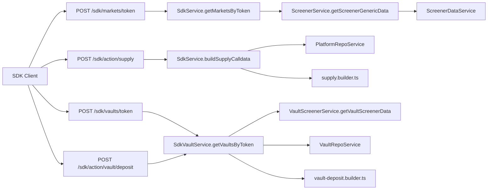

# Add Vaults To SDK Flow

## Goal

Expose vault opportunities and vault deposit calldata in SDK-compatible endpoints without changing current lending market behavior.

- Keep existing lending endpoints unchanged:
  - `POST /sdk/markets/token`
  - `POST /sdk/action/supply`
- Add vault-specific SDK endpoints:
  - `POST /sdk/vaults/token`
  - `POST /sdk/action/vault/deposit`
- Deposit scope:
  - LOOP: `vaultRouter.depositWithToken(...)` using default token only (DIRECT path)
  - FUND: `vault.deposit(uint256,address)` direct deposit
- Explicitly out of scope for now: swap-route payloads, multi-token deposits, WRAP path, relay/cross-chain path.

## Current Flow Map

## Backend Changes (`superlend-aggregator-backend`)

### 1) Wire vault services into SDK module

- Update `[/Users/superlend/Documents/GitHub/superlend-aggregator-backend/apps/api/src/vault/vault.module.ts](/Users/superlend/Documents/GitHub/superlend-aggregator-backend/apps/api/src/vault/vault.module.ts)` to export `VaultScreenerService`.
- Update `[/Users/superlend/Documents/GitHub/superlend-aggregator-backend/apps/api/src/sdk/sdk.module.ts](/Users/superlend/Documents/GitHub/superlend-aggregator-backend/apps/api/src/sdk/sdk.module.ts)` to import `VaultApiModule`.
- Keep existing `ScreenerModule` import for lending routes.

Why: avoids re-implementing vault formatting and keeps SDK layer reusing existing vault API service patterns.

### 2) Add SDK vault DTOs

Create new DTOs under `[/Users/superlend/Documents/GitHub/superlend-aggregator-backend/apps/api/src/sdk/dto/](/Users/superlend/Documents/GitHub/superlend-aggregator-backend/apps/api/src/sdk/dto/)`:

- `sdk-vault-token-markets.dto.ts`
  - `chainId: number`
  - `tokenAddress: string` with lowercase `Transform` (same address normalization pattern as `[sdk-token-markets.dto.ts](/Users/superlend/Documents/GitHub/superlend-aggregator-backend/apps/api/src/sdk/dto/sdk-token-markets.dto.ts)`)
- `sdk-vault-deposit.dto.ts`
  - `vaultId: string`
  - `amount: string` (smallest units)
  - `userAddress: string`
- `sdk-vault-deposit-response.dto.ts`
  - `{ to, data, value, approval? }` aligned with existing SDK response shape from `[sdk-supply-response.dto.ts](/Users/superlend/Documents/GitHub/superlend-aggregator-backend/apps/api/src/sdk/dto/sdk-supply-response.dto.ts)`

### 3) Add vault calldata builder

Create `[/Users/superlend/Documents/GitHub/superlend-aggregator-backend/apps/api/src/sdk/calldata/vault-deposit.builder.ts](/Users/superlend/Documents/GitHub/superlend-aggregator-backend/apps/api/src/sdk/calldata/vault-deposit.builder.ts)`:

- LOOP builder:
  - encode `depositWithToken(vaultAddress, depositManager, token, amount, scheduledFlag, swapParams)`
  - always `scheduledFlag = 0`
  - always empty swap params with tokenIn=tokenOut=default token and empty data list
- FUND builder:
  - encode `deposit(uint256,address)` directly on vault address

Reuse approval helper from `[approval.builder.ts](/Users/superlend/Documents/GitHub/superlend-aggregator-backend/apps/api/src/sdk/calldata/approval.builder.ts)`.

### 4) Add vault SDK service logic

Either extend `[sdk.service.ts](/Users/superlend/Documents/GitHub/superlend-aggregator-backend/apps/api/src/sdk/sdk.service.ts)` or create a dedicated `sdk-vault.service.ts` (preferred for SRP):

- `getVaultsByToken({ chainId, tokenAddress })`
  - call `VaultScreenerService.getVaultScreenerData()`
  - filter by `chainId`
  - filter by `defaultDepositToken === tokenAddress` (lowercased compare)
  - return `{ markets: filteredVaults, total }`
- `buildVaultDepositCalldata({ vaultId, amount, userAddress })`
  - load vault details via repository/service
  - branch by vault type:
    - LOOP -> use router + default token + deposit manager
    - FUND -> use vault address + default token
  - check allowance using existing viem allowance approach in `[SdkService.checkNeedsApproval](/Users/superlend/Documents/GitHub/superlend-aggregator-backend/apps/api/src/sdk/sdk.service.ts)`
  - attach `approval` when needed

### 5) Add SDK controller routes

Update `[/Users/superlend/Documents/GitHub/superlend-aggregator-backend/apps/api/src/sdk/sdk.controller.ts](/Users/superlend/Documents/GitHub/superlend-aggregator-backend/apps/api/src/sdk/sdk.controller.ts)`:

- add `POST sdk/vaults/token`
- add `POST sdk/action/vault/deposit`
- keep `@UseGuards(SdkApiKeyGuard, ThrottlerGuard)` inherited at controller level
- add Swagger docs mirroring existing clarity for SDK routes

### 6) Keep response compatibility and explicit separation

- Do not mix vault and lending entities in one route yet.
- Return vault opportunities in a dedicated SDK response to avoid type collisions between:
  - lending market model from `[ScreenerService](/Users/superlend/Documents/GitHub/superlend-aggregator-backend/apps/api/src/screener/screener.service.ts)`
  - vault model from `[VaultScreenerResponseDto](/Users/superlend/Documents/GitHub/superlend-aggregator-backend/libs/common/dto/api/vault/screener-response.dto.ts)`

## SDK Package Changes (`superlend-sdk/packages/sdk`)

### 7) Extend SDK client methods and types

Update `[/Users/superlend/Documents/GitHub/superlend-sdk/packages/sdk/src/superlend-client.ts](/Users/superlend/Documents/GitHub/superlend-sdk/packages/sdk/src/superlend-client.ts)`:

- add `getVaultMarkets(params)` -> `POST /sdk/vaults/token`
- add `buildVaultDepositCalldata(params)` -> `POST /sdk/action/vault/deposit`

Update `[/Users/superlend/Documents/GitHub/superlend-sdk/packages/sdk/src/types/index.ts](/Users/superlend/Documents/GitHub/superlend-sdk/packages/sdk/src/types/index.ts)`:

- add vault opportunity response/request types
- add vault deposit request/response types
- keep existing `Market` + `SupplyCalldata*` untouched for backward compatibility

Update exports in `[/Users/superlend/Documents/GitHub/superlend-sdk/packages/sdk/src/index.ts](/Users/superlend/Documents/GitHub/superlend-sdk/packages/sdk/src/index.ts)`.

### 8) Add SDK tests for new endpoints

Update/add tests in `[/Users/superlend/Documents/GitHub/superlend-sdk/packages/sdk/src/test/superlend-client.test.ts](/Users/superlend/Documents/GitHub/superlend-sdk/packages/sdk/src/test/superlend-client.test.ts)`:

- success/error for `getVaultMarkets`
- success/error for `buildVaultDepositCalldata`
- preserve existing tests for lending endpoints

## React Package Changes (`superlend-sdk/packages/react`)

### 9) Add vault-mode path with minimal UI disruption

Current flow in `[superlend-widget.tsx](/Users/superlend/Documents/GitHub/superlend-sdk/packages/react/src/components/superlend-widget.tsx)` is lending-specific (`useMarkets` + `buildSupplyCalldata`).

Plan:

- Introduce an explicit mode prop, e.g. `product: 'lending' | 'vault'` (default `lending`)
- For `vault` mode:
  - fetch via new hook `useVaultMarkets`
  - execute via new hook `useVaultTransaction`
  - keep existing widgets/components where possible, but use vault-specific type-safe payloads

Minimal first pass:

- Reuse `MarketCard` visual shell only if vault shape can be mapped cleanly; else add `VaultOpportunityCard`.
- Keep approval + tx step UX pattern from `[transaction.hooks.ts](/Users/superlend/Documents/GitHub/superlend-sdk/packages/react/src/hooks/transaction.hooks.ts)` but call `buildVaultDepositCalldata`.

### 10) React API and typing updates

Update `[/Users/superlend/Documents/GitHub/superlend-sdk/packages/react/src/types/index.ts](/Users/superlend/Documents/GitHub/superlend-sdk/packages/react/src/types/index.ts)`:

- extend `WidgetProps` with vault mode params (`vaultId`/token/chain constraints as needed)
- add vault action callback type
- keep current lending callback untouched

Add hooks:

- `hooks/vault-opportunities.hooks.ts`
- `hooks/vault-transaction.hooks.ts`

## UI Flow Alignment Notes (`superlend-ui-v2` reference)

Use current implementation as contract reference for calldata semantics:

- LOOP direct deposit path in `[vp-tx-dialog.tsx](/Users/superlend/Documents/GitHub/superlend-ui-v2/src/components/vault-page/tx-widget/vp-tx-dialog.tsx)` via `depositWithToken` with empty swap params.
- FUND direct deposit path in same file via `deposit(uint256,address)`.
- Non-goal branches to skip now:
  - swap quote path from `[getSwapRouteQueryOptions](/Users/superlend/Documents/GitHub/superlend-ui-v2/src/queries/vault.queries.ts)`
  - swap decode + `handleDepositWithToken`
  - relay path in `[vp-tx-earn-deposit-field.tsx](/Users/superlend/Documents/GitHub/superlend-ui-v2/src/components/vault-page/tx-widget/vp-tx-earn-deposit-field.tsx)`
  - wrap flow.

## Validation and Testing Plan

### Backend

- unit tests for vault DTO validation and lowercase normalization
- unit tests for vault calldata builders (LOOP and FUND function selector + args)
- service tests:
  - token+chain filtering correctness
  - allowance-needed branch adds approval
  - missing vault/router/depositManager returns clear error
- controller e2e tests for new SDK routes under API key guard

### SDK package

- client tests for both new endpoints (MSW)
- request payload and response mapping checks

### React package

- hook tests for vault data + vault tx execution flow
- component tests for vault mode rendering and callback execution

## Risks and Mitigations

- Vault/lending response mismatch: keep separate endpoints and separate TS types.
- Address case bugs: enforce lowercase transform and lowercase comparisons everywhere token matching is used.
- Missing vault metadata (router/depositManager): validate early and return typed API error before calldata encoding.
- Over-coupling SDK service: prefer `SdkVaultService` to keep `SdkService` focused on lending.

## Rollout Strategy

- Phase 1: backend routes + sdk package methods + tests
- Phase 2: react vault mode integration
- Phase 3: optional future merge/unified opportunities contract if product asks for one feed
